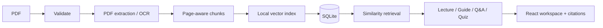

# PDF-to-Lecture

PDF-to-Lecture (LumiNote) turns a PDF into a cited, interactive learning workspace. It ingests text or scanned documents in the background, builds a local vector index, and creates a structured lecture, study guide, source-grounded Q&A experience, and scored quiz. The application works without an API key and retains Gemini behind a provider boundary for optional model-backed generation.

## Demo

Start the application, open `http://localhost:5173`, and upload [`examples/learning-science-demo.pdf`](examples/learning-science-demo.pdf). Within a few seconds you can navigate its lecture, ask “Why is retrieval practice useful?”, generate simpler explanations, and complete a cited quiz.

## Problem

Long documents are difficult to turn into an active study routine. A generic LLM summary loses source location and makes unsupported answers hard to detect. PDF-to-Lecture keeps page-level provenance throughout ingestion and reuses one retrieval layer for every learning mode.

## Features

- Secure, bounded PDF upload with magic-byte validation, filename sanitization, OCR fallback, SHA-256 duplicate detection, and page metadata
- Page-aware, heading-sensitive chunking with configurable size and overlap
- Dependency-free local vector index with similarity thresholding and page citations
- Background ingestion states plus polling and Server-Sent Event progress
- Pydantic-validated lectures, study guides, quizzes, citations, and API requests
- Lecture navigation and “simpler / example / analogy / deeper” explanations
- Conversational document Q&A that declines unsupported questions
- SQLite artifact caching and operation/retrieval metrics
- Deterministic evaluation suite, integration tests, Docker Compose, and GitHub Actions CI
- Responsive React interface designed for a clear 30-second product demo

## Architecture



FastAPI routes are thin adapters over ingestion, retrieval, storage, and learning services. SQLite and an in-process worker pool are appropriate for a portable single-instance demo; their interfaces make a durable queue or hosted vector store a future deployment choice. See [the architecture document](docs/architecture.md) for flows, caching, failure behavior, and security boundaries.

## AI and retrieval pipeline

The chunker preserves page, section, index, and source text. A deterministic 384-dimensional signed feature hash embeds chunks locally. Retrieval combines cosine similarity with lexical overlap, applies `top_k` and a minimum score, and passes only matching evidence into learning outputs. Citations are built from the retrieved chunk metadata. If nothing meets the threshold, Q&A explicitly reports insufficient evidence.

This is real retrieval-augmented application infrastructure but not a claim that feature hashing outperforms neural embeddings. The `LLMProvider` interface and existing Gemini adapter isolate model calls so a schema-constrained generator can be introduced without coupling API routes to one vendor.

## Evaluation

Run `python -m evaluation.evaluate`. Results measured on September 10, 2026 in the local development environment:

| Metric | Result |
| --- | ---: |
| Retrieval Hit@3 | 1.00 (3/3) |
| Top citation accuracy | 1.00 (3/3) |
| Answer-criteria pass rate | 1.00 (3/3) |
| Median retrieval latency | 0.114 ms |

The versioned benchmark is intentionally small and transparent. It is a regression smoke test over the three-page demo, not a statistically meaningful claim about general document Q&A. No LLM judge or fabricated production data is used.

## Performance snapshot

Seven local warm runs over the three-page demo measured 11.98 ms median extraction/chunking/embedding time and 1.44 ms median grounded lecture construction. OCR, network TTS, filesystem state, document complexity, and hardware materially change these values; they are a reproducible baseline, not a throughput guarantee.

## Tech stack

- Python, FastAPI, Pydantic, SQLite
- pdfplumber, PyMuPDF, Tesseract/pytesseract
- deterministic feature-hash vectors and cosine retrieval
- optional Gemini adapter; optional Edge TTS/gTTS retained from the original prototype
- React 19, Vite, Tailwind CSS, Axios, Lucide
- pytest, Docker Compose, GitHub Actions

## API

| Method | Endpoint | Purpose |
| --- | --- | --- |
| `POST` | `/documents` | Validate, deduplicate, and enqueue a PDF |
| `GET` | `/documents` | Recent document library |
| `GET` | `/documents/{id}/status` | Job state and progress |
| `GET` | `/documents/{id}/events` | SSE processing updates |
| `GET` | `/documents/{id}/lecture` | Structured cited lecture |
| `GET` | `/documents/{id}/study-guide` | Reusable study guide |
| `POST` | `/documents/{id}/ask` | Grounded answer with citations |
| `GET` | `/documents/{id}/quiz` | Cited multiple-choice quiz |
| `POST` | `/documents/{id}/explain` | Reframe a lecture section |
| `GET` | `/metrics` | Aggregate operational metrics |
| `GET` | `/health` | Service health |

Interactive OpenAPI documentation is available at `http://localhost:8000/docs`.

## Running locally

Requirements: Python 3.9+, Node 22+, and Tesseract only if OCR is enabled.

```bash
python3 -m venv .venv
source .venv/bin/activate
pip install -r backend/requirements.txt
cp backend/.env.example .env
uvicorn backend.main:app --reload --port 8000
```

In another terminal:

```bash
cd frontend
npm ci
cp .env.example .env
npm run dev
```

The default path requires no Gemini key. Set `GEMINI_API_KEY` only when extending the optional provider integration. Keep TTS disabled unless using the retained legacy narration code.

## Docker

```bash
docker compose up --build
```

Open `http://localhost:5173`; the API and Swagger UI run on port 8000. SQLite data persists in the named `app-data` volume.

## Testing

```bash
source .venv/bin/activate
python -m pytest backend/tests -q
python -m evaluation.evaluate
npm --prefix frontend run build
```

The suite includes chunking, PDF cleanup, retrieval rejection/ranking, citation construction, artifact caching, request validation, and a real PDF ingestion-to-Q&A API flow.

## Project structure

```text
backend/        FastAPI API, ingestion, retrieval, learning, provider, storage
frontend/       React learning workspace
evaluation/     Versioned RAG benchmark and runner
examples/       Upload-ready demo PDF and editable source
docs/           Architecture and engineering decisions
.github/        CI build and test workflow
```

## Design decisions

- **Local vectors first:** zero credentials and deterministic evaluation are more useful here than an unneeded external dependency.
- **Small workflow, not agent theater:** analyzer/chunker, retriever, and learning service have clear responsibilities without a multi-agent framework.
- **Cache by content identity:** SHA-256 deduplication and document-scoped artifacts avoid duplicate compute; changing bytes creates a new namespace.
- **Truthful observability:** model/token fields exist for provider calls, while local operations report zero tokens instead of invented usage or cost.

## Limitations

Jobs are not durable across process restarts, SQLite is single-instance storage, heading detection is heuristic, the local embedding is lexical rather than neural, and generated learning artifacts are currently extractive. There is no authentication, tenant isolation, rate limiting, malware scanning, or hosted object storage. Do not expose this demo directly to untrusted public uploads without those controls.

## Future work

Add schema-constrained model generation plus a groundedness verification pass, expand the independently labeled evaluation set, persist jobs in a durable queue for multi-instance deployment, and add authenticated document ownership.
