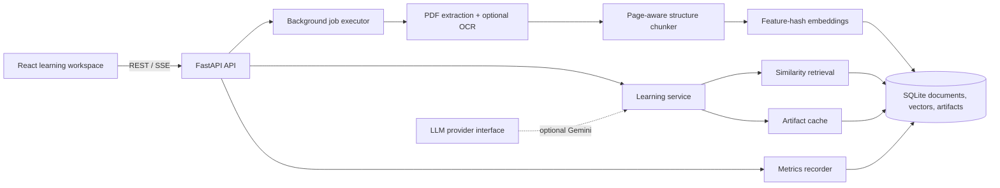

# Architecture

PDF-to-Lecture is a single-instance document learning system. It deliberately uses an in-process job executor and SQLite: they make local setup and a recruiter demo reliable without pretending that the portfolio workload needs distributed infrastructure. The service boundaries allow both to be replaced later.

## Document ingestion

`POST /documents` checks both the `.pdf` suffix and `%PDF-` signature, streams the body to a bounded temporary file, enforces the configured byte limit, sanitizes the display filename, and hashes the content. A completed matching hash is returned instead of being reprocessed.

The background workflow transitions through `QUEUED → PARSING → CHUNKING → EMBEDDING → GENERATING → COMPLETED` (or `FAILED`). `pdfplumber` preserves page boundaries; sparse pages can use Tesseract OCR. The chunker keeps page and detected-heading metadata, applies word overlap within a page, and never accepts a user-provided storage path.

## Retrieval and grounded outputs

Each chunk has a 384-dimensional signed feature-hash vector stored as JSON in SQLite. At query time, semantic cosine similarity is blended with lexical overlap. This local index is deterministic, requires no download or API key, and is sufficient for the demo corpus. Every result carries document, page, section, chunk, excerpt, and score data. A configurable threshold causes unsupported questions to return an explicit insufficient-evidence answer.

Lecture, guide, quiz, explanation, and Q&A reuse the same indexed chunks. Structured responses are validated with Pydantic. Lecture, guide, and quiz artifacts are cached by `(document_id, artifact_type)`; a new document hash creates a new namespace, which is the invalidation strategy.

`LLMProvider` defines generation and embedding boundaries, with a Gemini adapter retained from the original project. The default learning path is extractive and grounded so the no-key demo remains reproducible. A production extension can add schema-constrained Gemini generation and verification behind this boundary without changing the API.

## Storage and jobs

SQLite contains `documents`, `chunks`, `artifacts`, and `metrics`. A thread pool performs blocking PDF/OCR work without holding request connections. SSE status events and the polling endpoint expose progress. This design has at-most-process-lifetime job execution: an interrupted process can leave an active job unfinished. A multi-instance deployment should move jobs to a durable queue and vectors to a server database.

## Observability and failures

Metrics record operation, implementation/model, latency, prompt/completion tokens, configurable estimated cost, success state, metadata, and timestamp. `GET /metrics` aggregates calls and document/index counts. Gemini response usage is captured when the optional model path is used; pricing defaults to zero until explicit per-million-token rates are configured, avoiding stale cost claims. Expected PDF errors become safe job messages; unexpected exceptions are not sent to the browser. API validation uses Pydantic and structured FastAPI responses.

## Evaluation

`python -m evaluation.evaluate` runs a versioned three-question benchmark over the checked-in learning-science demo. It reports retrieval hit rate, top-citation accuracy, answer-criteria pass rate, and median retrieval latency. This is a regression smoke suite—not evidence of broad-domain RAG quality. Expanding the corpus and adding independently reviewed relevance/groundedness labels is the next evaluation step.

## Security boundaries

- Upload body and page limits are configurable.
- Extension, magic bytes, UUIDs, and request sizes are validated.
- Temporary files are generated by the OS and deleted on every terminal path.
- User filenames are display metadata only; they never form a storage path.
- Secrets are read from environment variables; `.env`, database, audio, and caches are ignored.
- CORS is allow-listed, and raw unexpected exceptions are withheld.

Authentication, tenant isolation, malware scanning, rate limiting, and encrypted object storage are intentionally out of scope for the local showcase and required before accepting untrusted public traffic.
